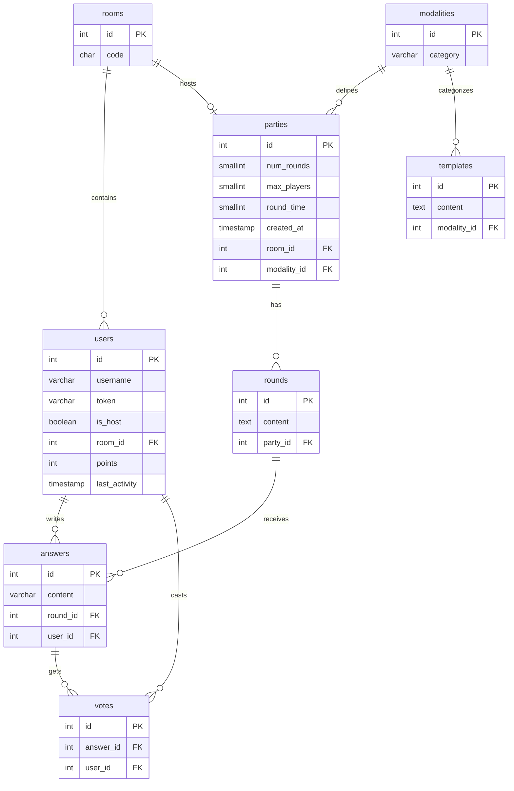

# CaptionIt

> **First project:** This is my first public project, built during the first year of my Higher Degree in Web Application Development (DAW). It was created to master client-server architecture, multiplayer games, and backend/frontend security practices. As my very first app, please note it might still have some bugs or areas to improve!

A multiplayer game where creativity and humor are the keys to victory. Players join a room using a code and compete by answering absurd prompts or adding captions to random memes. Through a blind voting system, players choose the funniest response, accumulating points to determine the winner of the game.

## Installation Instructions

### Prerequisites

Before starting, ensure you have the following installed:
* **Docker** (v20.10 or higher)
* **Docker Compose** (v2.0 or higher)
* **Git**

### Commands to Start

Follow these steps to spin up the entire ecosystem. The project is designed to work out of the box without manual configuration.

1. **Clone the repository** Download the project to your local machine:

```
git clone https://github.com/AndreuMartorellSerra/CaptionIt.git
cd CaptionIt
```

2. **Configure Environment Variables (Recommended)** Create a .env file from the template before starting to ensure consistent credentials, or skip this step to use the defaults in docker-compose.yml. Edit this file only if you need to override database or JWT values; it is gitignored for local security:

```
cp .env.example .env
```

3. **Launch with Docker** Build and start all services (Database, PostgREST, and Frontend):

```
docker compose up -d --build
```

4. **Verify the status** Check if all containers are running and the database is healthy:

```
docker compose ps
```

### Access

Once the services are up and running, you can access them at the following addresses:

| Service | URL | Description |
| :--- | :--- | :--- |
| **Frontend (App)** | [http://localhost:5173](http://localhost:5173) | The main game interface (Vite frontend with static HTML). |
| **API REST** | [http://localhost:3000](http://localhost:3000) | PostgREST interface to the database. |
| **API Docs** | [http://localhost:8084](http://localhost:8084) | Swagger UI to explore and test the API. |
| **pgAdmin** | [http://localhost:8083](http://localhost:8083) | Database management (use credentials from `.env`). |

---

### 🔑 Default Credentials
If you haven't changed the `.env` file, use these credentials to log in:
* **pgAdmin User:** `admin@example.com`
* **pgAdmin Password:** `replace-with-a-secure-password`
* **PostgreSQL role:** `postgres`
* **PostgreSQL password:** `replace-with-a-secure-password`

## Relational Model Diagram


